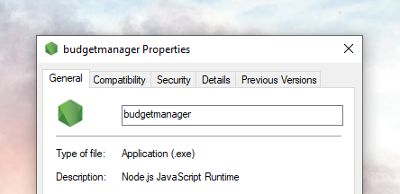

# BudgetManager
A simple budget manager that is super easy to use, runs on command line and uses Nodejs server

How to use:
Make sure you are running on a Nodejs server

Go to your local where the file is hosted such as local server, change "yourname" to personalize it
C:\xampp\htdocs\nodejs\budgetmanager_yourname>

Make sure you have Node.js installed, then create a folder for your project and run:

`npm init -y`

This initializes a new project. We’ll also use the csv-writer package to simplify CSV handling:

`npm install csv-writer`

Then simply run

`node budgetmanager.js`

From here you can access basic command to interact with the App

To add money to your budget simply type in:

`cash-in <amount> <description>`

To subtract money to your budget simply type in:

`cash-out <amout> <description>`

type 'exit' when you are done and it will show you a balance sheet of the transaction you've just made

The data is saved on the App and if you run it again on other time you can add fund or withdraw fund anytime and everything is on the record :)

Now what if you simply want to execute check balance, we have that feature too :), simply type this

`view-account-statement`

Now what if you want to reset the account to zero? simply type warning: this deletes all the record and your money is gone!

`reset-account`

For simplicity of use i decided not to add any password. So what if you want multiple user? Just create a new folder for them with their name and you can run the script for that account alone

Data save:

csv and text file of transactions

I provided a zip file. Enjoy managing your budget on the CLI, cool right? :)

also available to run executable:

note: designed to be as simple as possible so it does not care if you cash-in negative amount or cash-out amount exceeding the current balance. 
